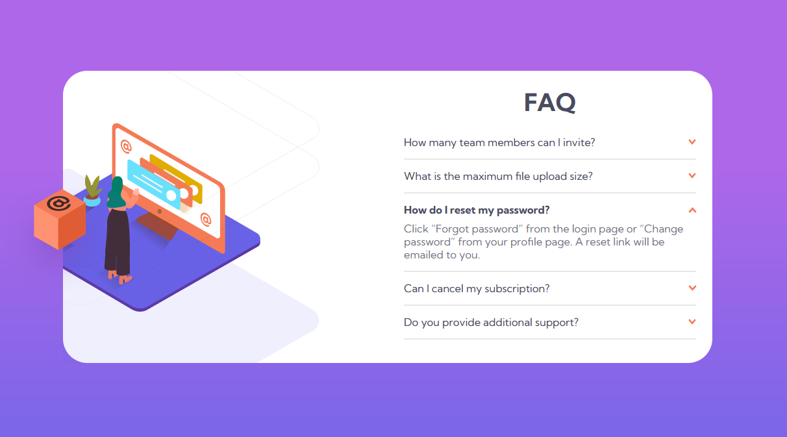
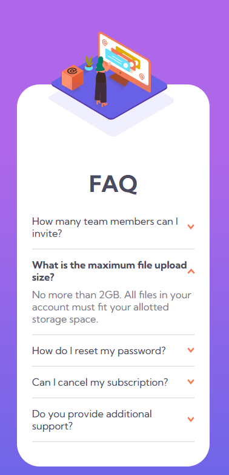

# Frontend Mentor - FAQ accordion card solution

### Build Purpose: Learning - Challenge - [FAQ accordion card challenge on Frontend Mentor](https://www.frontendmentor.io/challenges/faq-accordion-card-XlyjD0Oam).

### Description:

FAQ Section for websites.

### Features

- Responsive for mobile and different devices.
- Easily customisable

## PREVIEW

### Personal Notes

- Learnt Node nextSibling property : to select sibling element of an element using DOM API.

- Learnt
  DOMTokenList contains() method.
  We cant use includes method on DOMTokenList which is returned by Node.classList. We've to use contains()

- HTMLElement: dataset property. We can give customized attributes for html elements and can be manipulated same with Node.dataset property.

### Observations

- Observations on Z index
- Observations on Overflow
